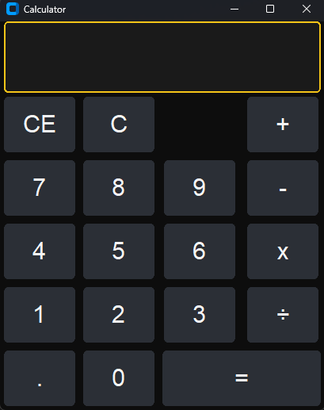

# Python Calculator App

A desktop calculator built using Python and CustomTkinter with a clean dark UI.

## Features
- Addition, subtraction, multiplication, division
- Decimal input support
- Clear entry and full reset
- Divide-by-zero error handling
- Operator highlighting

## Tech Used
- Python
- CustomTkinter

## Screenshot

## How to Run
1. Install requirements:
   pip install customtkinter

2. Run:
   python main.py
